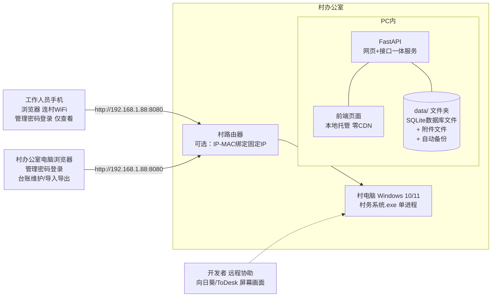
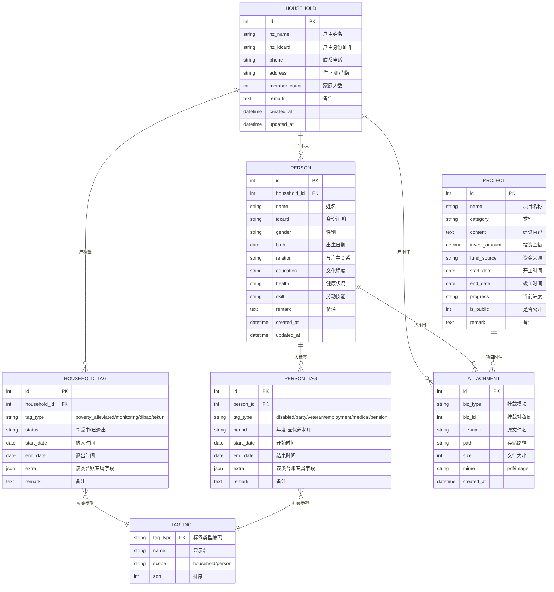
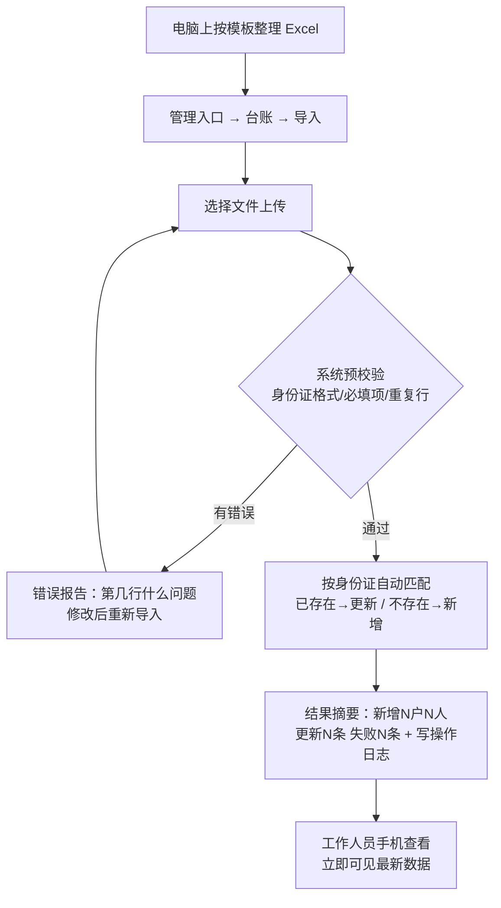
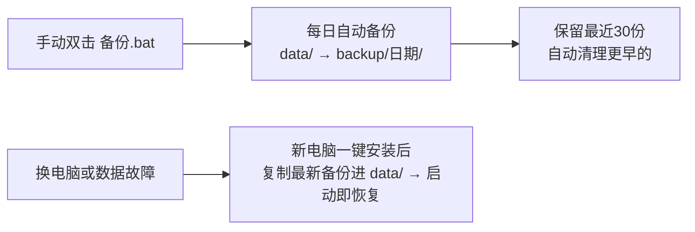
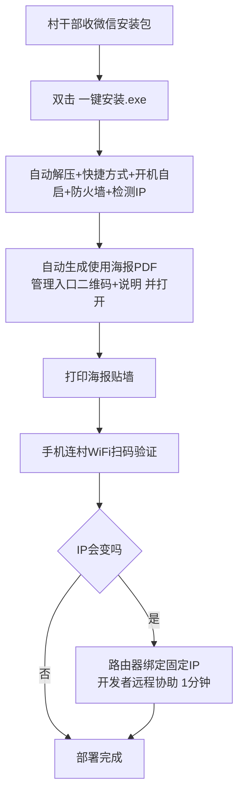

# 村务管理系统 设计文档

- 日期：2026-09-07（2026-09-09 调整：仅工作人员使用）
- 状态：已确认设计
- 形态：单村局域网版（村电脑部署 + 手机浏览器访问 · 仅工作人员使用）

---

## 1. 项目概述

### 1.1 目标

为**一个村**建设一套轻量村务数据系统：村务工作人员在村办公室电脑上维护各类台账（Excel 批量导入或网页录入），并用**手机浏览器**随时查看，数据全部保存在村内电脑，**不上传任何云端服务器**。

### 1.2 核心价值

1. **数据一次录入、处处复用**：户、人只录一次身份证，十一类台账（含居民信息名册）自动关联，户情报告自动聚合生成，杜绝重复填报。
2. **手机随时查看**：工作人员手机随时查看全部台账，与电脑端数据一致、仅布局不同；增删改与导入导出在电脑端完成。
3. **部署与维护零门槛**：一键安装、双击启动、复制文件夹即备份，村干部无需任何技术背景。

### 1.3 已确认的需求决策

| 决策点 | 结论 |
|---|---|
| 组织范围 | 单村（数据模型预留多村扩展位，不实现） |
| 部署位置 | 村内一台 Windows 10/11 电脑，长期开机 |
| 访问方式 | 仅局域网（手机连村 WiFi，浏览器访问），不做远程访问 |
| 云端 | 不上传云端服务器；运行期零外网依赖（前端资源本地打包，不用 CDN） |
| 使用范围 | 仅村务工作人员；电脑端全功能（增删改/导入导出），手机端仅查看（数据一致、布局不同） |
| 管理操作 | 增删改/导入导出需输入管理密码（单一密码，无账号体系） |
| 户情报告 | 系统从台账自动聚合生成，可导出 PDF |
| 后台技术 | Python FastAPI + SQLite |
| 部署方式 | 一键安装 exe + 向日葵远程协助 |
| 访问入口 | 管理入口二维码，安装时自动生成海报 PDF 打印贴墙 |

### 1.4 明确不做（边界）

- 不做微信小程序（强制要求备案域名 + HTTPS 云服务器，与"不上云"冲突）
- 不做多村/乡镇/县级平台
- 不做线上办事申请、不接政务接口
- 不做流程审批、消息推送、通知中心
- 不做村民端（免登录浏览、身份证查询本户信息）
- 不做 MySQL/Docker/集群等重部署形态
- 不使用 WPS 等第三方在线表格

---

## 2. 总体架构

### 2.1 架构图

### 2.2 形态决策

| 决策 | 结论 |
|---|---|
| 服务形态 | 单进程：FastAPI + uvicorn，同时承担网页托管、业务接口、数据存储 |
| 数据库 | SQLite 单文件（WAL 模式），村级规模（几千人、数万条记录）性能充裕 |
| 附件存储 | `data/attachments/` 本地文件夹，数据库仅存文件索引 |
| 端口 | 默认 8080（可在设置中修改） |
| 访问地址 | `http://村电脑IP:8080`，推荐路由器绑定固定 IP（如 192.168.1.88） |
| 二维码 | 系统实时读取本机 IP 自动生成，管理首页展示；安装时自动生成 A4 海报 PDF（管理入口二维码 + 使用说明） |
| 备份 | 数据 = `data/` 一个文件夹；每日自动备份到 `backup/YYYYMMDD/`，保留最近 30 份；另提供双击 `备份.bat` 手动备份 |
| 前端 | Vue 3 + Vant 4 构建为静态文件，由 FastAPI 本地托管，手机优先、桌面可用 |

---

## 3. 访问与权限模型

### 3.1 使用范围

系统**仅面向村务工作人员**：无村民端、无公开浏览、无身份证查询；所有数据在管理密码登录后可见。

| 端 | 能力 |
|---|---|
| 电脑端 | 全功能：查看、新增、编辑、删除、Excel 导入导出、附件、户情报告、日志、备份 |
| 手机端 | 仅查看：与电脑端同一套数据、同一套九宫格入口，仅布局自适应手机；无任何编辑/导入入口 |

### 3.2 管理密码

- 单一管理员密码（PBKDF2 哈希存储于 SETTINGS 表），登录后浏览器会话保持（Cookie，7 天或关闭即失效）。
- 手机与电脑共用同一地址（`http://村电脑IP:8080`）和同一密码；手机打开自动呈现移动布局。
- 所有写操作（增删改、导入、导出、上传、备份）在管理会话内进行，并写入操作日志。
- 密码可随时在系统管理中修改。

---

## 4. 数据库设计

核心模型：**户 → 人 → 标签**。居民信息（人员名册）+ 十类台账 = 户标签或人标签；同一户/人只录一次，标签可叠加。

### 4.1 ER 图

辅助表：

| 表 | 用途 |
|---|---|
| SETTINGS | 键值表：村名、管理密码哈希、备份周期等 |
| OPERATION_LOG | 操作日志：时间、动作、模块、对象、变更前后 JSON、来源 IP |
| IMPORT_LOG | 导入记录：文件名、总行数、新增/更新/失败数、逐行错误明细 JSON |

共 10 张表。户情报告不落表，运行时聚合生成。

### 4.2 台账 → 标签映射与专属字段（extra JSON 内容）

| 台账 | 挂载 | tag_type | extra 专属字段 |
|---|---|---|---|
| 居民信息 | 人员名册（非标签，直接查人员表） | — | 姓名、身份证、住址、所属户等基础字段 |
| 脱贫户 | 户标签 | poverty_alleviated | 脱贫年度、致贫原因、帮扶责任人、帮扶措施 |
| 三类监测户 | 户标签 | monitoring | 监测类别（脱贫不稳定户/边缘易致贫户/突发严重困难户）、风险类型、风险消除时间 |
| 低保户 | 户标签 | dibao | 保障人数、月保障金、低保类别 |
| 特困供养户 | 户标签 | tekun | 供养方式（集中/分散）、月供养金、护理等级 |
| 残疾人 | 人标签 | disabled | 残疾证号、残疾类别、残疾等级、发证日期 |
| 党员 | 人标签 | party | 入党时间、党内职务、组织关系所在地 |
| 退役军人 | 人标签 | veteran | 入伍时间、退役时间、优抚类别、是否悬挂光荣牌 |
| 务工信息 | 人标签（可多条） | employment | 工作地点、单位、工种、月收入、务工起止时间 |
| 城乡医保 | 人标签（按年度多条） | medical | 年度、参保状态、缴费档次、缴费金额、缴费时间 |
| 养老保险 | 人标签（按年度多条） | pension | 年度、缴费档次、缴费金额、领取状态、月养老金 |

设计说明：

- `extra` 为 JSON 列，字段名在代码中配置（`ledger_config.py`），页面表单与 Excel 模板据此自动生成；新增台账类型不改表结构。
- 身份证是人员天然主键（唯一索引）；户主身份证在户表唯一。
- 同一户可同时带多个户标签（如既是脱贫户又是低保户）；同一人可带多个人标签（如既是党员又是退役军人）。
- 医保/养老按"人 × 年度"多条记录，天然支持历年缴费台账。

### 4.3 操作日志字段

| 字段 | 说明 |
|---|---|
| op_time | 操作时间 |
| op_type | 新增 / 编辑 / 删除 / 导入 / 导出 / 上传附件 / 删除附件 / 修改密码 / 备份 |
| module | 所属台账模块 |
| biz_type / biz_id | 操作对象类型与 id |
| before_json / after_json | 变更前后完整数据（删除操作凭 before_json 可恢复） |
| ip | 来源 IP |
| note | 备注（导入结果摘要等） |

---

## 5. 功能模块详细说明

### 5.1 管理首页（九宫格，手机/电脑一致）

- 九宫格模块入口：11 个数据台账（宫格带实时户数/人数统计）+ 6 个功能入口（户情报告、乡村项目、导入 Excel、操作日志、数据备份、系统设置）；手机 3 列、电脑 6 列。
- 村情简介卡片（富文本 + 图片，供工作人员查阅维护）。
- 最近操作列表（审计流）。
- 访问二维码展示（自动读取本机 IP 生成，供重打海报）。

### 5.2 台账中心（11 类台账，管理入口）

11 类台账 = 居民信息名册 + 十类标签台账（脱贫户、监测户、低保户、特困供养户、残疾人、党员、退役军人、务工信息、城乡医保、养老保险）。每类台账统一能力，共用一套通用引擎：

| 能力 | 说明 |
|---|---|
| 列表 | 搜索（姓名/身份证/户主）、筛选（标签状态、组别）、排序、分页 |
| 详情 | 户/人完整信息 + 全部标签 + 附件 |
| 新增/编辑 | 表单由字段配置自动渲染，身份证自动校验并反查是否已存在 |
| 删除 | 需确认；删除前数据完整写入操作日志，可追溯恢复 |
| Excel 模板下载 | 一键下载该台账模板 |
| Excel 批量导入 | 预校验 → 错误报告（逐行、注明原因）→ 按身份证匹配更新或新增 → 结果摘要 |
| Excel 导出 | 按当前筛选条件导出当前台账全部列 |
| 附件 | 每户/每人/每项目可挂 PDF、图片（每文件限 20MB，图片自动压缩缩略图） |

交互原则：手机端仅查看（无编辑/导入入口）；电脑端全功能（增删改、导入导出、附件）。

**管理首页九宫格**：管理员登录后直达九宫格首页，全部入口平铺展示——11 个数据台账入口（宫格带实时户数/人数统计）+ 6 个功能入口（户情报告、乡村项目、导入 Excel、操作日志、数据备份、系统设置）。手机 3 列、电脑 6 列；宫格配色：红=数据台账、金=功能入口。

### 5.3 户情报告（管理入口）

1. 户列表选一户（或按户主姓名/身份证搜索）。
2. 系统自动聚合生成结构化报告：
   - 户基本信息（户主、电话、住址、人数）
   - 家庭成员表（姓名、关系、性别、出生日期、文化程度、健康状况、劳动技能）
   - 政策享受清单（低保/特困/脱贫/监测等户标签现状及金额；成员残疾、党员、退役军人等个人标签）
   - 务工情况（当前务工记录）
   - 医保、养老缴费记录（按年度，近 5 年）
   - 政策性收入合计（低保金 + 特困供养金 + 养老金 + 务工月收入估算）
3. 网页预览 → 导出 PDF（reportlab 生成，A4，含村名、报告生成时间、数据截止时间）。
4. 生成动作记入操作日志。

### 5.4 乡村项目资料

- 项目列表（名称、类别、投资金额、进度）。
- 项目详情：建设内容、资金来源、起止时间、进度、附件（图片/PDF）。
- 项目资料供工作人员查阅与维护。

### 5.5 操作日志与导入记录

- 操作日志：按时间/动作/模块筛选，详情可展开查看变更前后 JSON。
- 导入记录：每次导入的文件名、行数统计、错误明细。

### 5.6 系统管理

- 修改管理密码。
- 数据备份（立即备份）/ 从备份恢复。
- 系统设置（村名、附件大小限制等）。
- 简单统计看板：各类户数、各类人数、党员数、退役军人数、医保/养老参保人数（按年度）。

---

## 6. 业务流程图

### 6.1 数据维护主流程

### 6.2 户情报告流程

### 6.3 备份与恢复流程

### 6.4 部署流程

---

## 7. Excel 模板与导入导出设计

### 7.1 模板规范（每类台账一个模板文件）

- **单 Sheet 宽表**，与村干部现有 Excel 台账样式一致：一户多行（每成员一行，户主信息列逐行重复），导入时按户主身份证自动归并。
- 表头固定；**第二行为灰色示例数据**，导入时自动跳过（示例行带"[示例] "前缀，仅起示范作用）。
- 性别、与户主关系、监测类别、残疾等级、参保状态等列设置 **Excel 数据验证下拉**，点选式填写，不手敲。
- 必填列标 \*；日期列统一格式 `YYYY-MM-DD`；身份证列自动检查位数。
- 身份证号在 Excel 中默认文本格式，避免科学计数法问题。

### 7.2 导入校验规则（导入前预校验，有错不入库）

1. 身份证格式：18 位（17 位数字 + 数字/X），15 位老号码给警告不阻断。
2. 必填项缺失：报行号 + 缺失列名。
3. 同一文件内身份证重复：报重复行号，取最后一行。
4. 出生日期未填时按身份证第 7-14 位自动补全。
5. 下拉列取值不在字典内：报行号 + 非法值。

### 7.3 导入策略

- 匹配键：人员按身份证、户按户主身份证。
- 已存在 → **更新**（覆盖同名字段）；不存在 → 新增。
- 提供"仅新增，不覆盖已有"勾选项（默认覆盖）。
- 结果摘要：总行数、新增户/人、更新条数、失败条数 + 错误明细表（可导出错误 Excel）。
- 导入整体记入 IMPORT_LOG 与 OPERATION_LOG。

### 7.4 导出

- 按当前列表筛选条件导出，列与台账模板一致，可直接当模板复用（首行表头，无示例行）。

---

## 8. 技术选型清单

| 层 | 选型 | 说明 |
|---|---|---|
| 语言/框架 | Python 3.11 + FastAPI + uvicorn | 打包进 exe，目标电脑无需安装 Python |
| 数据库 | SQLite（WAL 模式）+ SQLAlchemy | 单文件零运维，复制即备份 |
| Excel | openpyxl | 模板生成、数据验证、导入导出，全本地完成 |
| PDF | reportlab | 户情报告导出，Windows 打包无系统依赖 |
| 二维码 | qrcode + Pillow | 管理首页二维码、海报生成 |
| 密码 | 标准库 PBKDF2 哈希 | 无额外依赖 |
| 前端 | Vue 3 + Vant 4（移动优先）+ Vite | 构建产物本地托管，零 CDN |
| 打包 | PyInstaller 单 exe；一键安装用自解压 + 自动配置脚本 | 双击即装 |
| 远程协助 | 向日葵 / ToDesk（免费） | 仅中转屏幕画面，数据不出村 |

---

## 9. 部署与运维

### 9.1 一键安装包

村干部拿到的就是一个文件：`村务系统-一键安装.exe`。双击后全自动：

1. 解压程序到 `D:\村务系统\`（含 `村务系统.exe`、`web/` 前端、`data/` 数据目录、`备份.bat`、`使用说明.txt`）。
2. 创建桌面快捷方式（"村务系统"）。
3. 设置开机自启（启动文件夹）。
4. 防火墙放行 8080 端口。
5. 检测本机 IP，生成《使用海报.pdf》并自动打开：村名 + 管理入口二维码 + 三句话使用说明。
6. 完成。村干部打印海报贴墙即部署结束。

### 9.2 远程部署协助（开发者视角）

1. 村干部在村电脑安装向日葵，把识别码 + 验证码发给开发者。
2. 开发者远程：上传并运行一键安装 → 浏览器验证 →（可选）路由器绑定固定 IP（1 分钟）→ 手机扫码验证 → 告知村干部管理密码。

### 9.3 固定 IP 方案

- 首选：路由器管理页做 IP-MAC 静态绑定（如 192.168.1.88），一次配置永久有效，海报二维码永不失效。
- 兜底：IP 变化后，管理首页二维码自动更新，重打海报即可。
- 放弃主机名方案：安卓手机不支持 `.local` 名称解析，不可靠。

### 9.4 日常运维

| 场景 | 动作 | 执行者 |
|---|---|---|
| 每日 | 开机自启，无需操作 | 自动 |
| 备份 | 每日自动备份保留 30 份 + 定期双击 `备份.bat` | 自动 / 村干部 |
| 升级 | 开发者发新版 exe，替换后重启，data 目录不动 | 开发者远程或微信指导 |
| 排障 | 村干部开向日葵，开发者看日志文件修复 | 开发者 |
| 换电脑 | 一键安装到新电脑 → 复制最新备份进 data/ → 即恢复 | 开发者远程 |

### 9.5 硬件要求

- 任意 Windows 10/11 电脑（4GB 内存以上），村里现有办公电脑即可。
- 需长期开机、连接村 WiFi/路由器；电脑能上网（收微信安装包），系统运行本身不依赖外网。

---

## 10. 安全与隐私

1. **数据不出村**：全部数据存于村电脑本地，运行期零外网请求。
2. **管理密码**：PBKDF2 哈希存储；建议强度要求（8 位以上含字母数字）；登录会话 Cookie。
3. **操作审计**：所有写操作记录日志（含变更前后 JSON、来源 IP），日志不提供删除功能（仅管理员可查看）。
4. **局域网 HTTP 明文说明**：无 HTTPS（局域网无法备案证书），数据在村 WiFi 内明文传输；建议村 WiFi 使用 WPA2 密码且定期更换，管理密码不与 WiFi 密码相同。
5. **身份证数据**：仅存村电脑，不加密存储（SQLite 文件本身依赖 Windows 账户与实体安全）；如后期有等保要求可加字段级加密，本版不做。
6. **删除保护**：删除前数据完整写入日志，可手工恢复；数据目录每日自动备份兜底。

---

## 11. 后续可选演进（本版不做）

| 方向 | 说明 |
|---|---|
| 远程访问 | 加 Tailscale/蒲公英组网，工作人员离村也能访问；架构不变 |
| 村民端 | 如后续需要村民查询本户信息，可在现有权限模型上加身份证查询入口，数据模型不变 |
| 多村版本 | 数据模型加 village 维度表 + 登录账号体系即可扩展 |
| 上云/小程序 | 如未来政策要求上微信小程序，需迁至云服务器 + 备案域名 + HTTPS；数据库与业务逻辑可直接复用 |
| 数据分析 | 基于台账做防返贫分析、收入结构统计等 |

---

## 12. 开发实施要点（供后续编写实施计划参考）

1. 通用台账引擎先行：字段配置 → 表单/列表/详情自动渲染 → CRUD → 附件 → 日志，跑通低保户一个台账作为样板。
2. Excel 导入导出是质量关键：模板生成、预校验、错误报告、身份证归并需重点测试。
3. 手机端只读与电脑端全功能的权限边界必须用测试覆盖（手机端不得出现任何写操作入口）。
4. 一键安装脚本在纯净 Windows 虚拟机中反复演练（无 Python 环境、不同 IP 段、中文路径）。
5. 备份恢复演练：模拟数据目录损坏后从备份恢复全流程。
